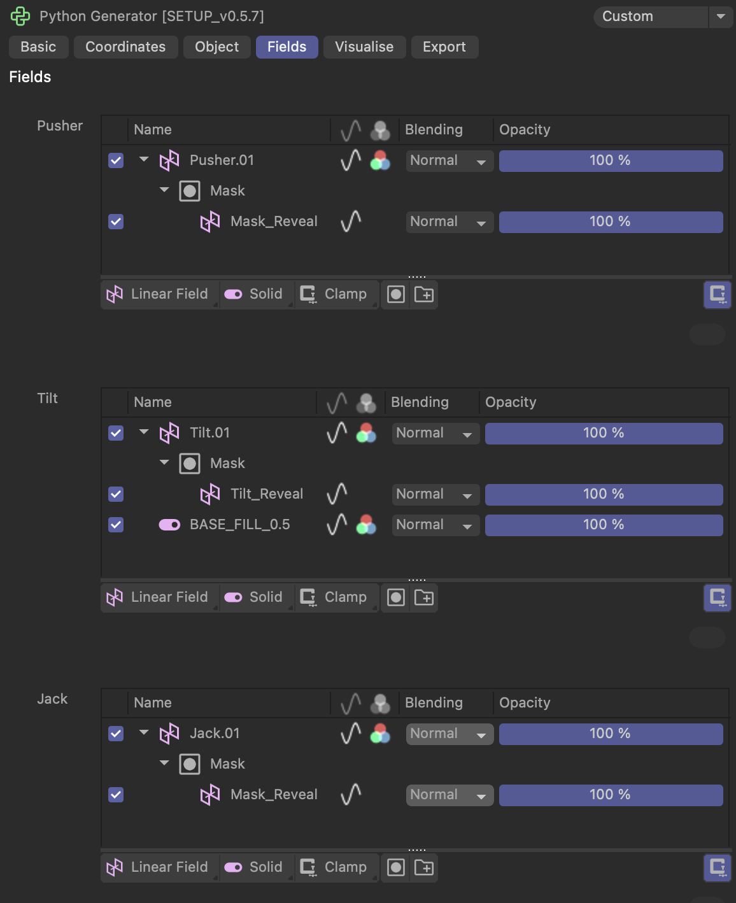

# C4D Kinetic Setup
<a href="https://github.com/gitkarpik/c4d-kinetic-setup?tab=readme-ov-file#c4d-kinetic-setup"></a>


Генератор превращает анимацию филдов в команды для  кинетических двигателей. У каждого экрана 3 степени свободы: Pusher, Tilt, Jack.

Лучше использовать одну группу филдов для задания формы, а с помощью второй, со Step ремаппингом, проявлять эту форму. Это будет соотвествовать команде контроллеров  "на 30 кадре смени выдвижение с 0% на 50%". Продолжительность анимации выставлена на вкладке Export -> Settings, соотвествует физическому сетапу.


## Fields

На вкладке **Fields** доступны три поля Field List:
#### Pusher 
* Раздвижение в стороны группами по 5 экранов
* [0мм - 1000мм]

#### Tilt
- Наклон каждого экрана отдельно вокруг его горизонтальной оси
- [-30°; 30°]

- ***Важно***: Tilt Field 0.5 -> 0° раскрытия. Стоит базовое заполнение 0.5 с помощью Solid Field. Анимация добавляется следующим слоем с наложением в режиме Normal поверх
- ***Важно*** : Тилт обрезается если подъём колец Jack меньше определенных позиций


#### Jack
- Подъём колец
- 0.0, 0.25, 0.5, 1.0 -> 0, 33, 66, 130 мм
- **Ограничивает Tilt**: 
  - 0.0 -> 0°
  - 0.25 -> ±10° 
  - 0.5 -> ±20°
  - 1.0 -> ±30°





## Visualize

## Export

### Bake To Preview
Запекает грубую анимацию генератора в плавную анимацию для превью проекта. Параметры анимации берутся из вкладки Settings ниже.

### Export JSON
- **JSON формат**: Сохраняет JSON-файл с командами для моторов
- **Разбивка на части**: Экспорт разделяется на временные промежутки для последовательной загрузки:
  - Часть 1: 0-25% таймлайна
  - Часть 2: 25-50% таймлайна  
  - Часть 3: 50-75% таймлайна
  - Часть 4: 75-100% таймлайна
- **Метаданные**: Информация о версии, времени создания, диапазоне кадров

### Структура данных
```json
{
  "name": "project_name",
  "type": "kinematic_preset",
  "data": {
    "row_1": {
      "pusher": {
        "id_1": [{"frame": 0, "start": 0, "dest": 1, "length": 30}],
         ...,
      },
      "tilt": {...},
      "jack": {...}
    }
  }
  "info": {
    "created_at": "date-time",
    "version": "1",
    "export_range": {
        "start_frame": 251,
        "end_frame": 500
    },
    "total_frames": 1000,
    "part": 2,
    "total_parts": 4,
    "fps": 60
  }
}
```
